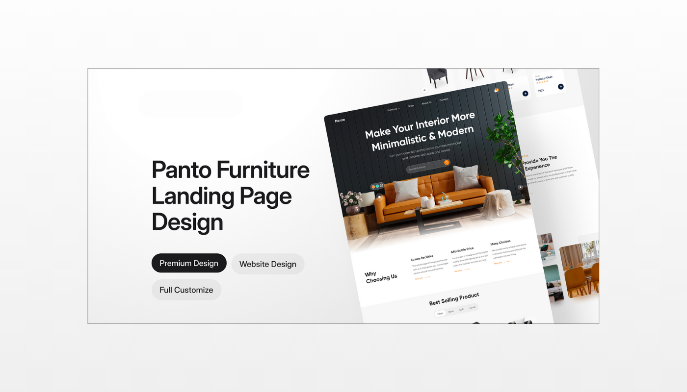
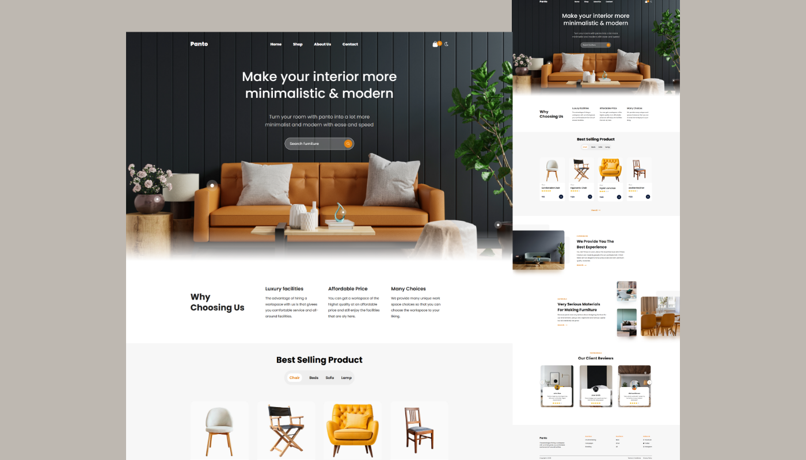
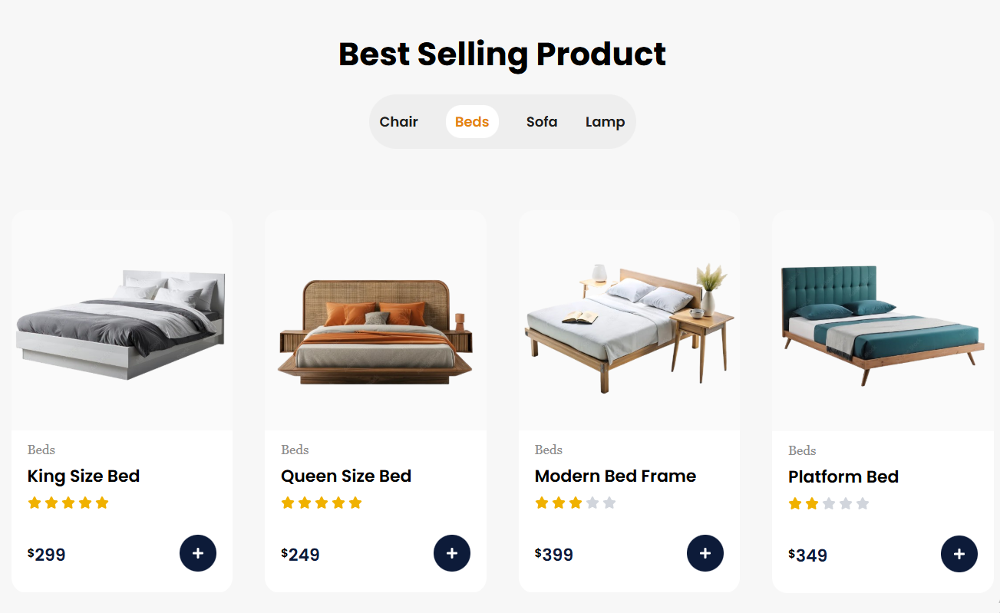
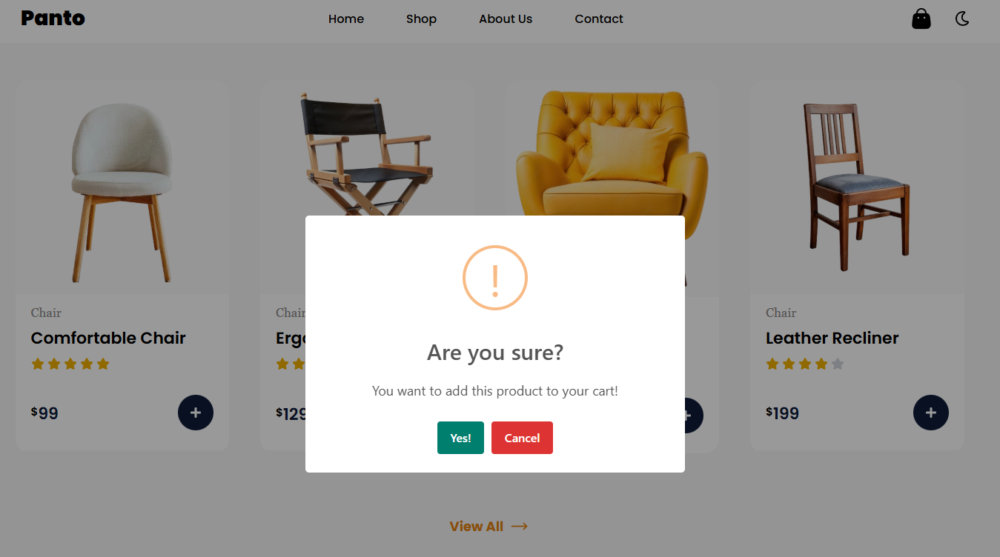
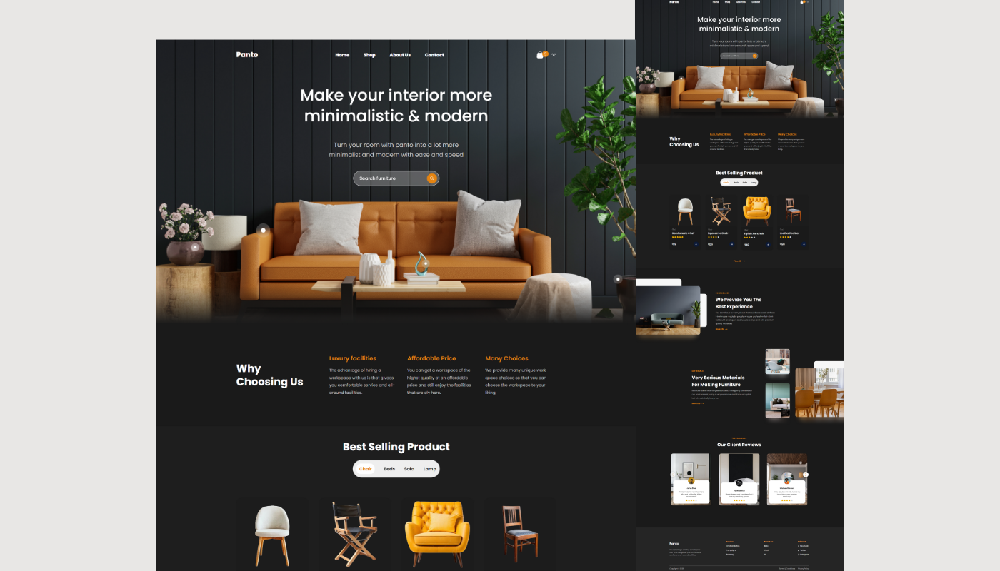
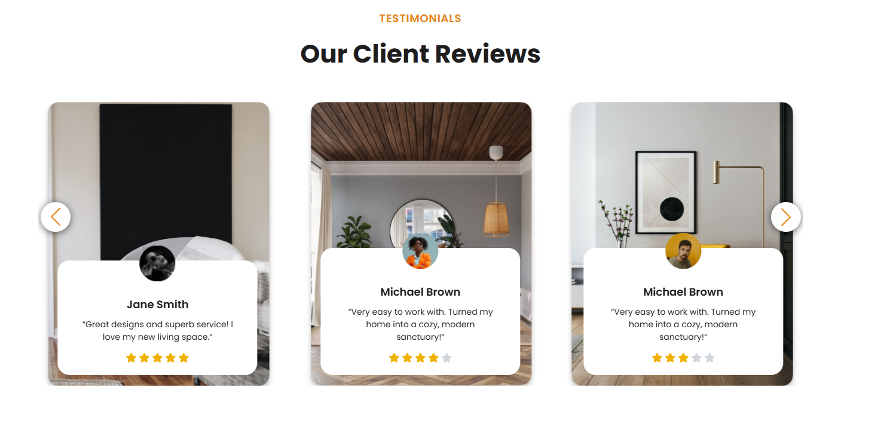

# 🛋️ Panto — Modern & Minimalistic Furniture Website

### 🧾 About This Project

A fully responsive, modern, and elegant React Furniture E-Commerce Website where users can browse, search, and interact with furniture products just like a real online furniture store.
Designed with a minimal aesthetic, smooth user experience, and clean component structure. The website allows users to explore various furniture categories, view best-selling items, read customer testimonials, and experience a premium store-like layout. The goal of this project is to create a visually appealing and user-friendly furniture website with real e-commerce-like features, responsive design, dark/light mode, and reusable components.



---
### 🔗 GitHub Repository

👉 [https://github.com/shadafhossain01/Panto-Landing-Page](https://github.com/shadafhossain01/Panto-Landing-Page)

### 🔗 Live Link

👉 [https://panto-landing-page-fawn.vercel.app](https://panto-landing-page-fawn.vercel.app)


## ✨ Features
### 🎨 Modern & Minimal UI

* Clean, stylish and high-end furniture store design

* Fully responsive for mobile, tablet, and desktop

* Smooth animations & hover effects

* Light Mode & Dark Mode support

### 🛒 E-Commerce Style Product System

* Browse items by category (Chair, Bed, Sofa, Lamp)

* Product cards with price, rating, and category label

* Add-to-Cart style interaction

* Realistic shop homepage layout

### 🔍 Smart Functionalities

* Search bar for quick product lookup

* Global state using Context API

* Reusable and scalable components

### ⭐ Testimonial Slider (Swiper.js)

* Built with Swiper.js

* Smooth slider animation

* Includes client photos, name, review & rating

* Fully responsive carousel

### 📄 Additional Sections

* “Why Choosing Us” section

* Experience & Material Quality info

* Professional footer with multiple link groups

* High-quality images and clean spacing


## 🚀 Tech Stack

| Technology               | Purpose                     |
| ---------------------- | ------------------------------------ |
| **React.js**           | UI development             |
| **React Router**   | Navigation & routing             |
| **Context API**            | Theme & global state management                |
| **JavaScript (ES6+)**       | Logic and functionality |
| **Flexbox & CSS Grid**         | Layout structure         |
| **Swiper.js** | Testimonial slider                                |
| **sweet alert** | Create Popup                                |
| **Local JSON / Static Data**            | Products & testimonial content |
| **Dark Mode / Light Mode**         | Theme switching         |


## ⚙️ How to Run Locally

```bash
# 1️⃣ Clone the repository
git clone https://github.com/shadafhossain01/Panto-Landing-Page
cd Panto-Landing-Page

# 2️⃣ Install dependencies
npm install

# 3️⃣ Start the React app
npm run dev
```

Then open the app in your browser:
👉 **[http://localhost:5173](http://localhost:5173)**


---


## 🖼️ Screenshots

 ### 🏠 Homepage Preview


### 🪑 Best Selling Products


### ⏺️ Add to Cart Popup


### 🌗 Dark Mode


### ⭐ Testimonial Slider


## ⭐ Support

If you like this project, please give it a star ⭐ on GitHub — it helps a lot!